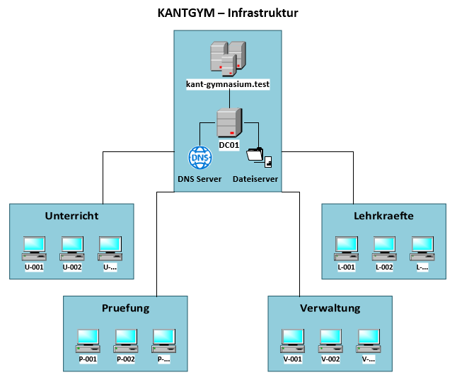
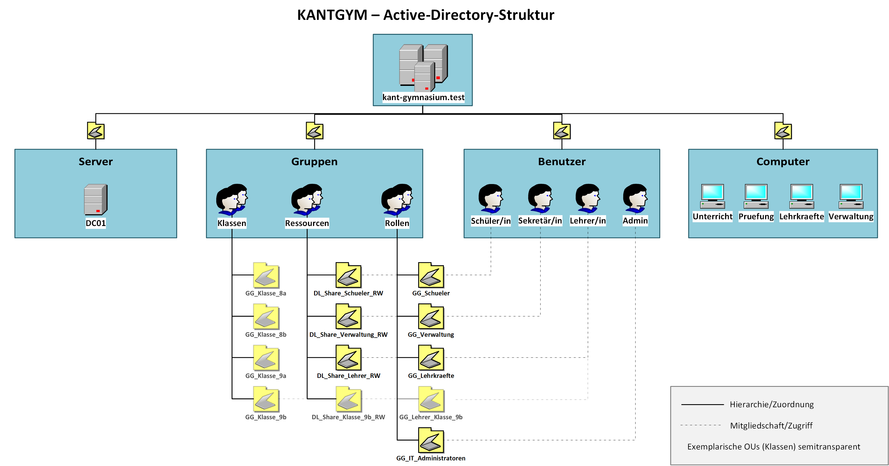
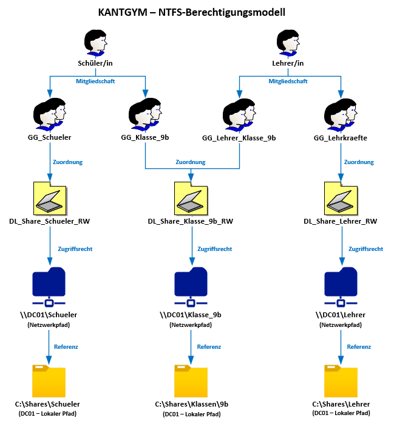
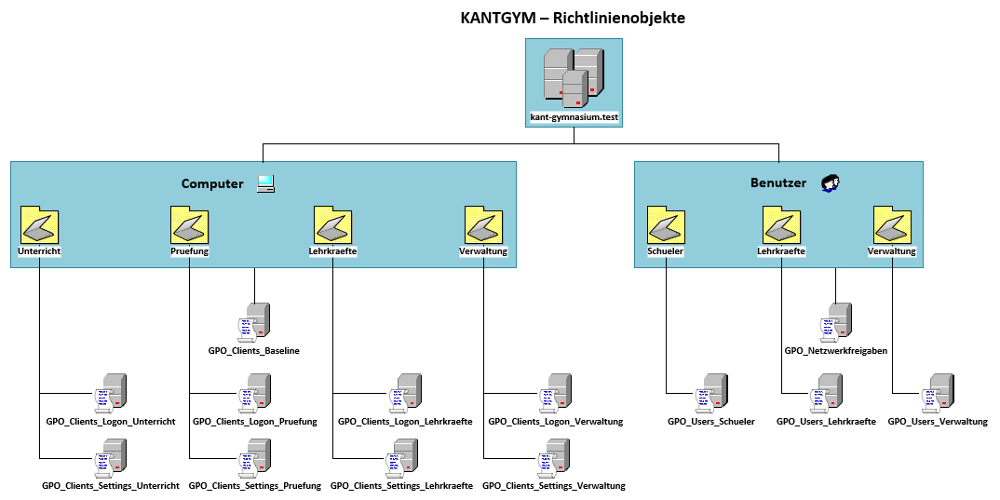
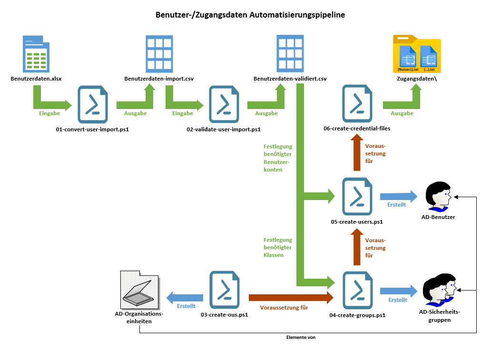

# KANTGYM – Automatisierte Active-Directory-Umgebung

Dieses Projekt bildet eine zentral verwaltete Windows-Domänenumgebung für das fiktive Kant-Gymnasium ab. 
Die Umsetzung umfasst die Verwaltung von Benutzern, Computern und Gruppen sowie die Konfiguration von Berechtigungen, 
Netzwerkfreigaben und Gruppenrichtlinien.

Das Projekt wurde in einer Hyper-V-Testumgebung mit Windows Server 2025 und Windows 11 Education umgesetzt. 
Ein besonderer Schwerpunkt liegt auf der Automatisierung wiederkehrender Administrationsaufgaben mit PowerShell.

Das Projekt ist als technisches Portfolio-Projekt konzipiert und dokumentiert sowohl den Aufbau der Umgebung als 
auch deren praktische Validierung.

---

## Projektüberblick

Das Projekt umfasst eine vollständige, für ein Gymnasium modellierte Windows-Domänenumgebung mit folgenden 
zentralen Komponenten:

- Active-Directory-Domäne `kant-gymnasium.test`
- Windows Server 2025 als zentraler Server `DC01`
- Benutzer- und Computerverwaltung über Active Directory
- rollenbasierte Gruppen- und Berechtigungsstruktur
- SMB-Netzwerkfreigaben für schulische Bereiche und Klassen
- zentrale Clientkonfiguration über Gruppenrichtlinien
- automatisierte Bereitstellung mit PowerShell
- Validierung anhand verschiedener Benutzer- und Clientszenarien

Die technische Umsetzung wird durch fünf Visio-Diagramme dokumentiert. Eine ergänzende Streamlit-Projektseite 
stellt die wichtigsten Komponenten, Konfigurationen und Testergebnisse dar.

[STREAMLIT-LIVE-LINK](https://kantgym.streamlit.app/)

---

## Zielsetzung

Ziel des Projekts ist es, den Aufbau und die Verwaltung einer kleinen schulischen Windows-Domäne strukturiert, 
nachvollziehbar und möglichst reproduzierbar umzusetzen.

Dabei werden organisatorische Anforderungen eines Gymnasiums in technische Strukturen übersetzt. Schüler, 
Lehrkräfte, Verwaltung und IT werden durch entsprechende Organisationseinheiten und Gruppen abgebildet. 
Berechtigungen werden dabei nicht direkt einzelnen Benutzern zugewiesen, sondern über Gruppenstrukturen verwaltet.

Ein weiterer Schwerpunkt ist die Trennung von Benutzer- und Computerkonfiguration. Dadurch können beispielsweise 
Benutzerrollen unabhängig von der Nutzung eines bestimmten Clients verwaltet werden, während computerspezifische 
Einstellungen abhängig vom Einsatzbereich des jeweiligen Geräts angewendet werden.

Wiederkehrende Administrationsaufgaben werden mit PowerShell automatisiert. Dadurch soll insbesondere gezeigt 
werden, wie sich die Bereitstellung und Konfiguration einer solchen Umgebung gegenüber einer ausschließlich 
manuellen Administration vereinheitlichen und reproduzierbar gestalten lässt.

---

## Infrastruktur

Die Projektumsetzung erfolgte vollständig in einer **Hyper-V-Testumgebung**.

Als zentraler Server dient ein Windows Server 2025 mit dem Hostnamen `DC01`. Der Server übernimmt mehrere 
zentrale Aufgaben innerhalb der Domäne:

* Active Directory Domänendienste
* DNS
* Dateiserver
* zentrale Gruppenrichtlinienverwaltung

Als Client wird Windows 11 Education eingesetzt. Die Computer werden entsprechend ihrer vorgesehenen 
Verwendung unterschiedlichen Organisationseinheiten zugeordnet.

Die verwendete Domäne ist:

```text
kant-gymnasium.test
```

Der grundlegende Aufbau der Umgebung ist in der folgenden Übersicht dargestellt.



*Abbildung 1: KANTGYM – Infrastruktur und Server-/Client-Rollen*

---

## Active-Directory-Struktur

Die Active-Directory-Struktur orientiert sich an der organisatorischen Gliederung des Gymnasiums. 
Benutzer, Computer und Gruppen werden in getrennten Organisationseinheiten (OUs) verwaltet.

Die Benutzerstruktur umfasst die Bereiche `IT`, `Lehrkraefte`, `Schueler` und `Verwaltung`. Computer 
werden abhängig von ihrem Einsatzbereich den entsprechenden OUs zugeordnet.

Für Gruppen wird zwischen Rollen-, Klassen- und Ressourcengruppen unterschieden. Dadurch können 
organisatorische Zugehörigkeiten und Berechtigungen getrennt voneinander abgebildet werden.



*Abbildung 2: KANTGYM – Active-Directory-Struktur mit OUs und Gruppen*

Die Klassenstruktur wird dabei dynamisch anhand der vorhandenen Klassen berücksichtigt. Dadurch können 
beispielsweise Klassen- und Ressourcengruppen sowie zugehörige Freigaben an die tatsächlich vorhandenen 
Klassen angepasst werden.

---

## Berechtigungsmodell

Für die Vergabe von Ressourcenberechtigungen wird ein rollenbasiertes Gruppenmodell verwendet. Benutzer 
werden zunächst Mitglied entsprechender globaler Gruppen. Diese Gruppen werden anschließend mit 
domänenlokalen Ressourcengruppen verschachtelt.

Das grundlegende Prinzip lässt sich vereinfacht darstellen als:

```text
Benutzer
    ↓
Globale Gruppe
    ↓
Domänenlokale Ressourcengruppe
    ↓
Ressource
```

Dadurch werden Benutzerverwaltung und Ressourcenberechtigungen voneinander getrennt. Änderungen an der 
Benutzerzugehörigkeit müssen somit nicht unmittelbar an den einzelnen Ressourcenberechtigungen vorgenommen werden.



*Abbildung 3: KANTGYM – Rollenbasiertes Berechtigungsmodell*

Zusätzlich wird eine gemeinsame Gruppe für Lehrkräfte und Schüler (`GG_Lehrkraefte_Schueler`) verwendet, um 
Lehrkräften ebenfalls Zugriff auf die Schülerfreigabe zu gewähren.

---

## Gruppenrichtlinien

Gruppenrichtlinien werden eingesetzt, um Einstellungen zentral für Benutzer und Computer vorzugeben.

Dabei werden unterschiedliche GPOs für allgemeine Sicherheitsvorgaben, rollen- bzw. OU-spezifische 
Client-Einstellungen sowie Benutzerkonfigurationen verwendet.

Beispiele sind:

| GPO                                | Zweck                                                         | Exemplarische Einstellung/en                                                                 |
|------------------------------------|---------------------------------------------------------------|----------------------------------------------------------------------------------------------|
| `GPO_Clients_Baseline`             | Zentrale Sicherheits- <br/>und Netzwerkeinstellungen          | Firewall, Antivirus, Echtzeitschutz, <br/>Warten auf Netzwerk bei Anmeldung                  |
| `GPO_Clients_Settings_Lehrkraefte` | Einstellungen für Lehrkräftecomputer                          | Energiesparplan (Bildschirm, Standby)                                                        |
| `GPO_Clients_Settings_Pruefung`    | Einstellungen für Prüfungscomputer                            | Verweigerung des Wechselmedienzugriffs                                                       |
| `GPO_Clients_Settings_Unterricht`  | Einstellungen für Unterrichtscomputer                         | Inaktivitätsgrenze                                                                           |
| `GPO_Clients_Settings_Verwaltung`  | Einstellungen für Verwaltungscomputer                         | Windows Update Konfiguration                                                                 |
| `GPO_Clients_Logon_*`              | Anmeldeberechtigungen                                         | Lokale Anmeldung rollenabhängig <br/>zugelassen                                              |
| `GPO_Users_*`                      | Benutzerabhängige Einstellungen                               | Rollenabhängige Desktophintergründe <br/>(zu Illustrationszwecken)                           |
| `GPO_Netzwerkfreigaben`            | Automatische Bereitstellung <br/>relevanter Netzwerkfreigaben | Gruppenabhängige Erstellung/Bereinigung von <br/>Desktopverknüpfungen zu freigegeben Ordnern |

Die grundlegende Zuordnung der Richtlinien ist in der folgenden Übersicht dargestellt.



*Abbildung 4: KANTGYM – Gruppenrichtlinienstruktur und -zuordnung*

Die tatsächliche Anwendung der Richtlinien wurde anschließend mit `gpresult` überprüft. Die entsprechenden 
Auswertungen werden im Abschnitt [Tests und Validierung](#tests-und-validierung) dokumentiert.

---

## Automatisierung mit PowerShell

Ein zentraler Bestandteil des Projekts ist die Automatisierung wiederkehrender Administrationsaufgaben mit 
**PowerShell**. Die einzelnen Skripte sind nach ihrem jeweiligen Aufgabenbereich nummeriert und bauen logisch 
aufeinander auf.

### Übersicht der Skripte

| Skript                              | Aufgabe                                                                        |
|-------------------------------------|--------------------------------------------------------------------------------|
| `01-convert-user-import.ps1`        | Konvertiert die bereitgestellten Benutzerdaten in ein einheitliches CSV-Format |
| `02-validate-user-import.ps1`       | Prüft die importierten Benutzerdaten und erzeugt eine validierte Importdatei   |
| `03-create-ous.ps1`                 | Erstellt die definierte OU-Struktur                                            |
| `04-create-groups.ps1`              | Erstellt Rollen-, Klassen- und Ressourcengruppen                               |
| `05-create-users.ps1`               | Erstellt die Benutzerkonten anhand der validierten Benutzerdaten               |
| `06-create-credential-files.ps1`    | Erzeugt die entsprechenden Zugangsdaten-Dateien                                |
| `07-create-file-structure.ps1`      | Erstellt die Verzeichnisstruktur auf dem File Server                           |
| `08-cleanup-file-structure.ps1`     | Prüft und bereinigt nicht mehr benötigte Klassenverzeichnisse                  |
| `09-configure-file-server.ps1`      | Konfiguriert grundlegende Einstellungen des Dateiservers                       |
| `10-configure-ntfs-permissions.ps1` | Setzt die NTFS-Berechtigungen für die Verzeichnisse                            |
| `11-create-shares.ps1`              | Erstellt und überprüft die SMB-Freigaben                                       |
| `12-cleanup-old-class-shares.ps1`   | Entfernt nicht mehr benötigte Klassenfreigaben                                 |
| `13-create-gpo-shortcuts.ps1`       | Erstellt die Verknüpfungen der Netzwerkfreigaben für die Benutzer-GPO          |

Die Skripte decken damit den wesentlichen Bereitstellungsprozess von den **Benutzerdaten über Active Directory 
bis zur Dateiserver- und GPO-Konfiguration** ab.

Die Automatisierung reduziert manuelle Arbeitsschritte und ermöglicht es, die Umgebung nach Änderungen oder in 
einer Testumgebung reproduzierbar neu aufzubauen. Wo sinnvoll, sind die Skripte so ausgelegt, dass bereits 
vorhandene Strukturen erkannt werden und nicht unnötig erneut erstellt werden.

---

## Benutzerdaten und Provisionierung

Die Benutzerverwaltung beginnt mit einer strukturierten Excel-Datei. Die Arbeitsmappe `Benutzerdaten.xlsx` enthält 
getrennte Tabellen für **Klassen, Schüler, Lehrkräfte, Verwaltung und IT**. Sie basiert auf einer Formatvorlage
(`Formatvorlage-Benutzerdaten.xltx`), welche diverse Datenüberprüfungen vornimmt, um fehlerhafte oder unvollständige 
Eingaben zu minimieren. 

Die eigentlichen Stammdaten werden zunächst durch PowerShell in ein einheitliches Importformat überführt und 
anschließend validiert. Dabei werden unter anderem Pflichtfelder, Nummernbereiche, doppelte Werte und mögliche 
Account-Namen geprüft.

Auf Basis der validierten Daten werden anschließend die benötigten Active-Directory-Objekte automatisiert angelegt. 
Dazu gehören Benutzerkonten, Gruppenzuordnungen und die dynamisch aus den vorhandenen Klassen abgeleiteten 
Klassengruppen.

Für die neu angelegten Konten werden anschließend separate Zugangsdaten-Dateien erzeugt. Die enthaltenen Daten 
dienen ausschließlich als **Beispieldaten für das Portfolio-Projekt**.

Der Ablauf ist in der folgenden Übersicht dargestellt:



*Abbildung 5: KANTGYM – Pipeline von den Benutzerdaten bis zur Bereitstellung der Benutzerkonten und Zugangsdaten*

Die Pipeline trennt damit die **Datenerfassung, Validierung, Provisionierung und Bereitstellung** voneinander und 
ermöglicht eine nachvollziehbare Verarbeitung der Benutzerdaten.

---

## Dateiserver und Netzwerkfreigaben

Der Windows Server `DC01` übernimmt neben den Domänencontroller- und DNS-Aufgaben auch die Bereitstellung zentraler 
Dateien und Netzwerkfreigaben.

Die Verzeichnisstruktur befindet sich unter:

```text
C:\Shares
├── Schueler
├── Lehrer
├── Verwaltung
└── Klassen
    ├── 8a
    ├── 8b
    ├── 9a
    └── 9b
```

Die Klassenverzeichnisse werden dynamisch anhand der tatsächlich vorhandenen Klassen erstellt. Dadurch kann die 
Umgebung beispielsweise um weitere Klassen erweitert werden, ohne die grundlegende Dateiserver-Konfiguration manuell 
anpassen zu müssen.

Für die zentralen Bereiche und Klassen werden entsprechende **SMB-Freigaben** bereitgestellt:

| Bereich    | Beispiel-Freigabe   |
|------------|---------------------|
| Schüler    | `\\DC01\Schueler`   |
| Lehrkräfte | `\\DC01\Lehrer`     |
| Verwaltung | `\\DC01\Verwaltung` |
| Klasse 8a  | `\\DC01\Klasse_8a`  |

Die Zugriffskontrolle erfolgt über die zuvor eingerichteten Active-Directory-Gruppen. Dabei werden 
**NTFS-Berechtigungen** und **SMB-Freigabeberechtigungen** getrennt konfiguriert.

Zusätzlich werden nicht mehr benötigte Klassenverzeichnisse und Freigaben erkannt und können kontrolliert entfernt 
werden. Dadurch bleibt die Dateiserver-Struktur konsistent mit der aktuellen Klassenstruktur.

---

## Tests und Validierung

Nach der automatisierten Bereitstellung wurde die Umgebung anhand verschiedener Benutzer- und Computerszenarien 
überprüft.

Getestet wurden unter anderem:

* Anmeldung mit unterschiedlichen Benutzerrollen
* Anwendung der Benutzer- und Computer-GPOs
* Zugriff auf die jeweils vorgesehenen Netzwerkfreigaben
* Einschränkungen für nicht berechtigte Benutzer
* rollenabhängige lokale Anmeldung an Clients
* automatische Bereitstellung der Netzwerkfreigaben
* Anwendung der Einstellungen auf unterschiedliche Computer-OUs
* Überprüfung der tatsächlich angewendeten Gruppenrichtlinien mit `gpresult`

Für die Tests wurden exemplarisch Benutzer aus den Bereichen **Schüler, Lehrkräfte und Verwaltung** verwendet. 
Der Testclient `Client-01` wurde dabei verschiedenen Computer-OUs zugeordnet, um die Auswirkungen der jeweiligen 
Computer-GPOs überprüfen zu können.

Die erzeugten `gpresult`-Auswertungen sind zusätzlich im Projekt unter `assets/gpresults/` enthalten und können 
über die begleitende Streamlit-Projektseite abgerufen werden.

---

## Streamlit-Projektseite

Neben dieser README enthält das Projekt eine **Streamlit-Projektseite**. Sie fasst die technische Umsetzung 
visuell zusammen und ergänzt die statische Dokumentation um Screenshots, Diagramme und Testergebnisse.

Die Projektseite zeigt unter anderem:

* die Infrastruktur der KANTGYM-Umgebung
* die Active-Directory-Struktur
* das Berechtigungsmodell
* die Gruppenrichtlinienstruktur
* die Benutzerdaten-Pipeline
* Beispielansichten der konfigurierten Clients
* Ergebnisse der durchgeführten Tests
* `gpresult`-Auswertungen der verschiedenen Benutzerrollen

[STREAMLIT-LIVE-LINK](https://kantgym.streamlit.app/)

## Hinweise zu den Beispieldaten

Bei sämtlichen im Repository enthaltenen Benutzerdaten, Konten, Zugangsdaten und sonstigen personenbezogenen Angaben 
handelt es sich ausschließlich um **fiktive Beispieldaten** für dieses Portfolio-Projekt.

Die enthaltenen Zugangsdaten-Dateien stellen keine echten Benutzerkonten dar. Passwörter werden ausschließlich als 
Platzhalter dargestellt.

Das Projekt wurde als isolierte Testumgebung umgesetzt und dient der Demonstration von 
Active-Directory-Administration, Automatisierung, Berechtigungsverwaltung und Group Policy.

## Projektstruktur

Die Dateien des Projekts sind nach ihrer jeweiligen Funktion organisiert:

```text
active_directory_kantgym/
├── assets/
│   ├── gpresults/
│   ├── graphs/
│   ├── screenshots/
│   └── user_data/
│
├── powershell_scripts/
│   ├── 01-convert-user-import.ps1
│   ├── 02-validate-user-import.ps1
│   ├── 03-create-ous.ps1
│   ├── 04-create-groups.ps1
│   ├── 05-create-users.ps1
│   ├── 06-create-credential-files.ps1
│   ├── 07-create-file-structure.ps1
│   ├── 08-cleanup-file-structure.ps1
│   ├── 09-configure-file-server.ps1
│   ├── 10-configure-ntfs-permissions.ps1
│   ├── 11-create-shares.ps1
│   ├── 12-cleanup-old-class-shares.ps1
│   └── 13-create-gpo-shortcuts.ps1
│
├── streamlit_app.py
├── README.md
└── .streamlit/
    └── config.toml
```

Die Verzeichnisse `assets/` und `powershell_scripts/` enthalten dabei die wesentlichen Bestandteile der technischen 
Dokumentation und Automatisierung. `streamlit_app.py` stellt die interaktive Projektpräsentation bereit.

---

## Technologien

Für die Umsetzung wurden folgende Technologien und Werkzeuge eingesetzt:

| Technologie / Tool                  | Einsatz                                                 |
|-------------------------------------|---------------------------------------------------------|
| **Hyper-V**                         | Virtualisierung der Server- und Clientumgebung          |
| **Windows Server 2025**             | Domain Controller, DNS und Dateiserver                  |
| **Windows 11 Education**            | Domänenclient                                           |
| **Active Directory Domänendienste** | Zentrale Benutzer-, Gruppen- und Computerverwaltung     |
| **DNS Server**                      | Namensauflösung innerhalb der Domäne                    |
| **Group Policy**                    | Zentrale Konfiguration von Benutzern und Clients        |
| **PowerShell**                      | Automatisierung der Administration                      |
| **SMB**                             | Bereitstellung der Netzwerkfreigaben                    |
| **Microsoft Visio**                 | Erstellung der Infrastruktur- und Prozessdiagramme      |
| **Streamlit**                       | Interaktive Präsentation und Dokumentation des Projekts |
| **Markdown**                        | Projektdokumentation und GitHub-README                  |

Die Kombination dieser Komponenten bildet eine reproduzierbare Testumgebung für die zentrale Verwaltung einer 
Windows-Domäne.

---

## Verfasser
Jan H. Schüttler ([LinkedIn](https://www.linkedin.com/in/jan-heinrich-sch%C3%BCttler-64b872396/))